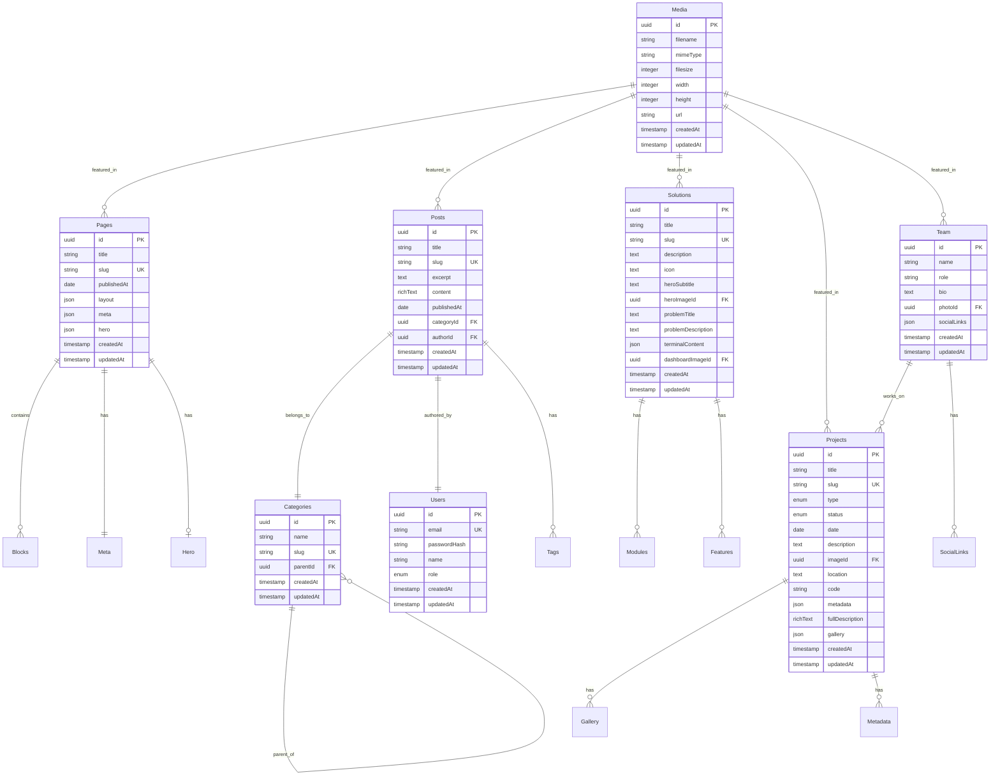

# ARCHITECTURAL DIAGRAMS
## Smatch Digital Website - Visual Documentation

---

## 1. SYSTEM OVERVIEW

### Full Stack Architecture

---

## 2. DATA FLOW DIAGRAMS

### Page Rendering Flow

### Content Creation Flow

### Search Flow

---

## 3. COMPONENT ARCHITECTURE

### Block System Architecture

### Component Hierarchy

---

## 4. DATABASE SCHEMA

### Entity Relationship Diagram

---

## 5. DEPLOYMENT ARCHITECTURE

### Vercel Deployment Flow

### Environment Configuration

---

## 6. SECURITY ARCHITECTURE

### Authentication Flow

### Security Layers

---

## 7. SCALABILITY ARCHITECTURE

### Horizontal Scaling Strategy

### Caching Strategy

---

## 8. MONITORING & OBSERVABILITY

### Monitoring Stack

---

*Diagrams created by The Honored One (Architect Mode)*
*Date: 2026-01-10*
